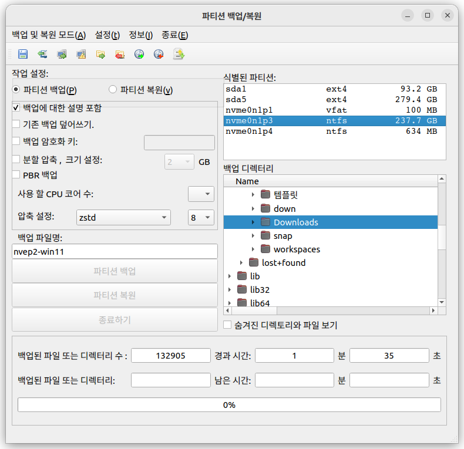

## qt-fsarchiver

파티션이나 디스크를 백업 및 복구하는 프로그램 (MBR/GPT 지원)

화면에 보이는 다양한 설정을 통해 사용자 데이터의 쉬운 백업 및 복구 가능



 * `알려진 버그 : 백업 디렉토리 경로를 한글로 사용하면 백업 이미지 생성 불가`
 * upstream : https://sourceforge.net/projects/qt-fsarchiver/
 * MBR을 포함한 파티션 전체를 이미지로 백업하고 복구 가능. (백업파일 보관이나 이동이 쉬움)
 * 안전한 백업을 위해서 백업할 타겟 디스크는 마운트 해제 필요.
 * 사용 중인 시스템을 백업하려면 별도의 OS(live CD)로 부팅해서 사용 가능. (하모니카OS 라이브 부팅 환경에 기본제공)

## 주요기능
 * 여러개의 파티션이 있는 경우에도 전체 파티션을 백업하여 하나씩 선택하여 복구 가능.
 * 백업파일을 안전하게 암호로 보호하는 기능 제공
 * 50% 정도의 데이터 압축률로 보관.
 * 다양한 포멧의 백업방식 지원

## 설치하기

### ubuntu (>=22.04) , HamoniKR (>=6.0)
```
wget -qO- https://repo.hamonikr.org/hamonikr-app.apt | sudo -E bash -

sudo apt install qt-fsarchiver
```

### ubuntu (<=20.04) , HamoniKR (<=5.0)
```
curl -sL https://pkg.hamonikr.org/add-hamonikr.apt | sudo -E bash -

sudo apt install qt-fsarchiver
```

## BUILD
### debian binary build from repo
```
# Install Build Dependancy
$ sudo mk-build-deps --install debian/control

# Create debian pkg
dpkg-buildpackage -b -rfakeroot -us -uc
```

### build with gpg sign from source (Ubuntu >=22.04)
```
sudo mk-build-deps --install debian/control

./release.sh
```